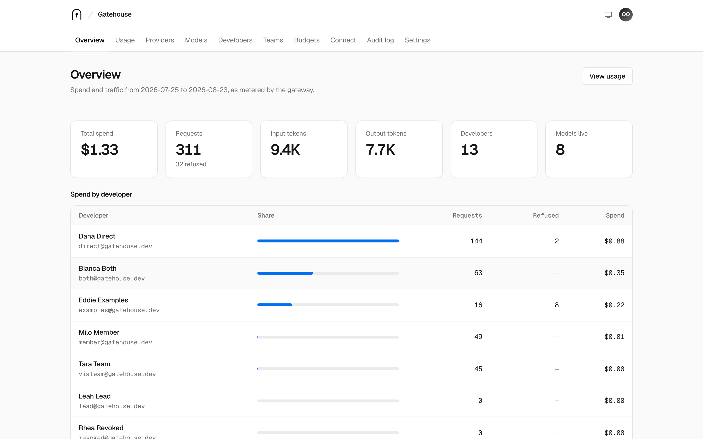
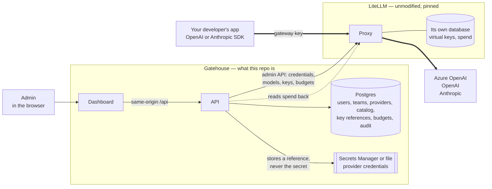

<h1 align="center">Gatehouse</h1>

<p align="center">
  <strong>Self-hosted control plane for the LiteLLM proxy.</strong><br>
  Give your developers virtual API keys with model access, budgets, and usage visibility —
  without ever handing out an OpenAI, Azure, or Anthropic credential.
</p>

<p align="center">
  <a href="https://github.com/harshsinghhsr/gatehouse/actions/workflows/ci.yml"></a>
  <a href="LICENSE"></a>
  
  
  
</p>

https://github.com/user-attachments/assets/9965daac-5e55-4d67-a4ac-673e2cc25981

<p align="center">
  <em>Fifty-eight seconds: the problem, where Gatehouse sits, what it refuses, and what LiteLLM charges for.</em>
</p>

---

## The problem

Your company buys LLM capacity once — an Azure OpenAI deployment, an OpenAI org, an Anthropic
account — and then has to share it with everybody who writes code.

In practice that means the provider key ends up in a group chat, a shared vault entry, or six
`.env` files. Once it spreads, you lose the things you actually needed:

- **You cannot tell who spent what.** One bill, one key, no attribution.
- **You cannot cap anyone.** A retry loop in a prototype bills the whole company.
- **You cannot revoke one person.** Rotating the key breaks every service at once.
- **You cannot control who reaches which model.** Everyone with the key has everything.
- **Offboarding is a rotation event**, so it quietly doesn't happen.

[LiteLLM](https://github.com/BerriAI/litellm) already solves the hard half of this. It proxies
every provider behind one OpenAI-compatible endpoint, authenticates virtual keys, enforces budgets
and rate limits, and prices every request. What it doesn't ship is the operational layer a company
needs on top: teams and roles, an admin who can onboard a provider without touching a
config file, a developer who can see their own usage, an audit trail of who granted what, and
somewhere safe for the provider credential to live.

**Gatehouse is that layer.** LiteLLM stays the gate — unmodified, unforked, pinned to a released
image. Gatehouse is the gatehouse: it decides who gets a key, what that key can reach, and what
happens when someone leaves.

## What your developers see

Two lines change. Every OpenAI-compatible SDK, framework, and tool keeps working.

```python
from openai import OpenAI

client = OpenAI(
    api_key="sk-gatehouse-issued-key",       # not your provider key
    base_url="https://llm.your-company.com/v1",
)
client.chat.completions.create(model="gpt-5", messages=[{"role": "user", "content": "Hello"}])
```

The same key works from the Anthropic SDK, LangChain, LlamaIndex, Cursor, or plain `curl` — it is
the LiteLLM endpoint underneath, so anything that speaks OpenAI or Anthropic speaks to it.

## What you get

| | |
|---|---|
| **Providers without credential sharing** | Add Azure OpenAI, OpenAI, or Anthropic once. The secret goes to AWS Secrets Manager or a 0600 file on the host — Postgres only ever stores a *reference*. It is never returned by an API, never logged, never in the browser bundle. |
| **Virtual keys, issued and revoked** | Mint a key for a developer, show it once, never store it. Revoke it and the next request fails at the gateway in seconds. Rotation does not touch anyone else. |
| **Per-model access grants** | A developer or team reaches exactly the models they were granted. Models are namespaced per provider, registered as `{providerSlug}/gpt-5`, so two providers can both offer `gpt-5`. |
| **Budgets that actually stop spend** | Monthly or daily caps per developer or per team, enforced by LiteLLM at request time — not a dashboard that emails you afterwards. |
| **Usage and cost attribution** | Spend per developer, per team, per model, over any date range, priced by LiteLLM's own cost map. |
| **Teams and RBAC** | Owner, admin, and member roles instance-wide; a team `LEAD` manages that team's own membership and model access from the dashboard as well as the API — the member picker reads `GET /teams/:id/candidates`, which returns only the names of people the caller may add to *that* team, never the roster. `userId` and `role` always come from the session, never from the request. |
| **An audit log you can defend** | Every mutation and its audit row commit in the same transaction, with secret-shaped values scrubbed before they are written. |
| **A connect page** | Copy-paste snippets with the developer's own base URL and model names, so onboarding is a link rather than a conversation. |

<p align="center">
  <picture>
    <source media="(prefers-color-scheme: dark)" srcset="docs/assets/dashboard-dark.png">
    
  </picture>
</p>

## Quickstart

Requires Docker and Docker Compose. No cloud account, no API key needed to try it.

```bash
git clone https://github.com/harshsinghhsr/gatehouse.git
cd gatehouse
./scripts/setup-env.sh     # writes .env with generated secrets
docker compose up
```

| Service | URL |
| --- | --- |
| Dashboard | <http://localhost:3000> |
| Control plane API | <http://localhost:3001> |
| LiteLLM gateway | <http://localhost:4000> |

Open the dashboard, choose **Set up the platform**, and create the first account — that bootstraps
the instance and its owner. Sign-up closes itself afterwards; admins add everyone else from
**Developers**.

Then: add a provider → add a model → add a developer → grant models → create a key → open
**Connect** for the snippets. `curl localhost:3001/ready` reports the health of every dependency.

To fill a fresh development instance with something to look at — the owner account, a spread of
roles and statuses, teams with and without a lead, budgets, and keys in every state — run:

```bash
npm run seed        # local instances only; prints the accounts and their password
```

The seed drives the same HTTP API the dashboard does, so everything it creates is validated,
synchronised to LiteLLM, and audited. It is safe to re-run: it reuses what already exists.
Providers are verified against the real vendor at creation time, so it only seeds them when you
supply working keys through `SEED_OPENAI_API_KEY`, `SEED_ANTHROPIC_API_KEY`, or `SEED_AZURE_API_KEY`;
without them it seeds everything else and says which providers it skipped.

### Seeing usage without a vendor account

`ENABLE_MOCK_PROVIDER=true` — set in `.env.example`, so a fresh clone already has it — registers a
**MOCK** provider type. Its models are registered with LiteLLM's own `mock_response`, so a request
never leaves the gateway and needs no API key, while LiteLLM still counts the tokens and prices them
from its table. The seed then issues real developer keys and sends a few dozen chat completions
through them, which is what puts spend, requests, tokens, and a per-developer distribution on the
dashboard. `docker compose up` plus `npm run seed` is the whole setup.

It is a demo aid, not a feature: the answers are fabricated. The production compose file never sets
the variable, and the API refuses to boot with `NODE_ENV=production` while it is on.

### Examples

[`examples/`](examples/) is split by reader. `developer/` is for someone who was handed a key:
a chat completion through the official OpenAI and Anthropic SDKs, a streaming one, and the same
call in `curl` — all straight to the proxy, since Gatehouse is not in the request path.
`operator/` is for whoever runs the instance: `onboard-developer.ts` walks the whole workflow in
one file (create a developer, grant models, set a budget, mint a key), alongside key rotation and
reading spend back out of `/api/usage`. Every file is standalone TypeScript run with `tsx`; the
operator ones are localhost-only and safe to re-run. The status codes a refused call returns are
documented in [`examples/README.md`](examples/README.md) and proved by
`apps/api/test/integration/enforcement.test.ts`.

## How it works



The thick arrows are the inference path. It starts at your developer's SDK and ends at the
vendor — **Gatehouse is not on it.**

Two properties fall out of this split, and both are deliberate:

- **The browser never holds a secret.** Not the master key, not a provider credential, not a
  gateway key beyond the single moment it is displayed.
- **Gatehouse is never in the path of an LLM request.** If the control plane is down, inference
  keeps serving. It is a control plane, not a proxy in front of a proxy.

## Why not just run LiteLLM?

Often you should. LiteLLM open source is more capable than most comparisons admit: it already
ships virtual keys, users, teams, budgets, rate limits, spend tracking, an admin UI, and
per-user email-and-password login with invite links. For a handful of developers that is
genuinely enough, and Gatehouse would be overhead.

What changes the answer is *where LiteLLM stops being free*. The operational half — the half you
need precisely when there are enough people that offboarding is a real event — is the half sold
as Enterprise.

| | LiteLLM open source | LiteLLM Enterprise | Gatehouse |
| --- | :---: | :---: | :---: |
| Gateway, 100+ providers, fallbacks | yes | yes | uses it |
| Virtual keys, budgets, rate limits, cost math | yes | yes | uses it |
| Users and teams, per-user login | yes | yes | its own |
| Global roles (`proxy_admin`, `internal_user`) | yes | yes | its own |
| **Audit log** | — | yes | **yes** |
| **Team-level admin delegation** (`team_admin`) | — | yes | **yes** |
| **Provider secrets in a secret manager** | — | yes | **yes** |
| **Key rotation** | manual endpoint | scheduled | **on demand, no plaintext** |
| Organizations, the outer tenant layer | — | yes | n/a, single-tenant by design |
| SSO / SAML / OIDC | up to 5 users | yes | **on the roadmap** |
| SCIM, JWT auth, IP allowlists, guardrails | — | yes | no |

<sup>Checked against LiteLLM's own docs and pricing page on 2026-08-23. Enterprise is quoted
annually against request capacity — there is no per-seat tier and no public price list.</sup>

**The four rows in bold are the whole argument.** Gatehouse implements them in your own
repository, under Apache-2.0, against endpoints that are unambiguously MIT:

- **The audit log** is not merely present, it is atomic — the mutation and its audit row commit
  inside the same transaction, so there is no window in which a change exists and the record of
  it does not.
- **Team-level delegation** means a team `LEAD` runs their own roster and model grants. Upstream
  that is the `team_admin` role, and `team_admin` is a premium feature.
- **Credential custody is architecturally different, not just cheaper.** Without the Enterprise
  secret-manager integration, provider keys live inside LiteLLM's database, encrypted with
  `LITELLM_SALT_KEY` — a value you can never rotate once models exist. Gatehouse puts the secret
  in AWS Secrets Manager and stores only a *reference* in Postgres.
- **Rotation never needs the plaintext.** We mint a new alias and delete the old one, because we
  deliberately never stored the key we would otherwise have to present.

There is a fifth reason that has nothing to do with price. LiteLLM's Enterprise gating largely
lives *in MIT-licensed files*, and [issue #34241](https://github.com/BerriAI/litellm/issues/34241)
documents eight features — organization management among them — gated only in the React frontend,
with no backend enforcement at all. The boundary is an open question. A governance layer should
not rest on a vendor's boolean flag whose legal status is unresolved; ours is code you own.

### What Gatehouse does not replace

If you need **SCIM provisioning, JWT auth, IP allowlists, or the guardrails suite**, that is
Enterprise and Gatehouse does not pretend otherwise. **SSO is the exception**: it is the first item
on the [roadmap](#roadmap), and the auth layer is isolated so it can be added without touching
route code — but it is not built yet, so today it is a plan rather than a feature. Gatehouse also
costs you a second Postgres and another service to operate. And it is **not** a LiteLLM
replacement or fork: keys, budgets, rate limits, cost math, and routing all stay upstream, which
is a maintenance decision as much as a technical one — when LiteLLM adds a provider, you get it.

Against a **hosted gateway**, the trade is the usual one. Your provider credentials never leave
your infrastructure, your spend data stays in your Postgres and your VPC, it runs with no internet
access beyond the providers themselves, and it costs nothing per request or per seat.

## Deploying

```bash
./scripts/setup-env.sh                              # if you have not already
# set WEB_ORIGIN and GATEWAY_PUBLIC_URL to your https URLs in .env
docker compose -f docker-compose.prod.yml up -d --build
```

That is the whole deployment. It differs from the development stack in the ways that matter:
Postgres and Redis are not published to the host, no source is mounted, the API runs as an
unprivileged user with `NODE_ENV=production`, the dashboard is static files behind nginx on
`:8080`, migrations are applied at boot, and everything restarts on its own.

Two ports need to be reachable: the dashboard (`WEB_PORT`, default 8080) and the gateway that
developer SDKs call (`GATEWAY_PORT`, default 4000). **Put TLS in front of both** — a reverse proxy,
a load balancer, or Cloudflare. The session cookie is `Secure` in production, so the API refuses to
boot if `WEB_ORIGIN` is not https, and it refuses to boot if the LiteLLM master key is still the
placeholder from `.env.example`.

The dashboard and the API are one origin: nginx proxies `/api` to the API container, so there is no
CORS to configure and nothing about your domain is baked into the frontend bundle. The same image
runs anywhere.

Provider credentials go to a 0600 file on a Docker volume by default, which needs no cloud account.
Set `SECRETS_BACKEND=aws` to put them in AWS Secrets Manager instead.

## Security

Threat model, what a dedicated review found and fixed, and what is deliberately still open:
[docs/security.md](docs/security.md). The short version:

- Provider credentials never touch Postgres, a log line, an audit entry, or an API response.
- Gateway keys are displayed once and never stored — only an alias, a token id, and a masked prefix.
- `userId` and `role` come from the session, always; a foreign record returns 404, not 403.
- Provider base URLs are checked against a host allowlist with private, loopback, and cloud
  metadata ranges refused, and redirects are never followed.
- Passwords are scrypt with a per-password salt; sessions are server-side in Redis with the id
  rotated on login; CSRF is SameSite=Lax plus an Origin check on every mutation.

Found something? [SECURITY.md](SECURITY.md) has the private reporting process.

## Development

```bash
npm install
npm run typecheck
npm test                                  # unit + HTTP tests, no services needed

docker compose up -d
INTEGRATION=1 npm run -w apps/api test    # acceptance flow + AWS contract, against the real stack

# migrations run inside the api container, which already has DATABASE_URL
docker compose exec api npm run -w apps/api prisma -- migrate dev --name <name>
```

The acceptance test is the real thing: it grants a model, mints a key, calls the gateway with an
OpenAI-shaped request, revokes the key, and asserts the next call fails with 401. It uses LiteLLM's
`mock_response`, so it never calls a real provider. CI runs it against a stack built from a clean
clone, then builds the production images — so a green build means a fork can deploy.

### How the code is organised

<details>
<summary><strong>Layout, layering rules, and the frontend design system</strong></summary>
<br>

The backend is layered, and the layers are enforced by what each one is allowed to import:

```text
http/          Fastify: server, guards, error handler        knows about HTTP
modules/*/     controller -> service -> repository           the business logic
core/          config, domain errors, ports, unit of work    knows about nothing
infra/         prisma, redis, litellm, secrets, logger       knows about vendors
container.ts   composition root: builds everything once
```

Services depend on interfaces (`UnitOfWork`, `LlmGateway`, `SecretStore`, …), never on Prisma or
`fetch`, so a unit test hands them an in-memory fake instead of a database. `packages/shared` holds
the zod contracts both apps import, so a payload change breaks the build rather than production.
The frontend is React on Vite, with TanStack Query owning all server state. Its design system
follows Geist — a neutral grayscale with one blue accent, hairline borders instead of shadows,
6px controls inside 12px cards, and light and dark themes that follow the system unless you pick
one. The tokens and every component live in one file, `src/styles/global.css`, so the look changes
in one place. Geist itself is vendored under `public/fonts`, so the dashboard makes no third-party
request and works air-gapped.

The API runs TypeScript directly through `tsx`, in development and production alike — one code
path, no build artifact to get stale. [CONTRIBUTING.md](CONTRIBUTING.md) has the rules that keep
this workable.

</details>

### Testing the AWS path without AWS

Provider credentials can live in AWS Secrets Manager. To exercise that code path locally, run
[floci](https://github.com/floci/floci) — the MIT-licensed AWS stand-in that covers Secrets
Manager, the only AWS service this needs:

```bash
docker compose --profile aws up -d floci
INTEGRATION=1 npm run -w apps/api test
```

The same `AwsSecretStore` class runs in both cases; only the endpoint differs. What you test
locally is the production code path, not a mock of it.

## FAQ

<details>
<summary><strong>Common questions</strong> — forking LiteLLM, supported providers, SDKs, AWS, Docker, tenancy, license</summary>
<br>

**Does this fork or patch LiteLLM?** No. It runs the released image
`ghcr.io/berriai/litellm:v1.97.0` and talks to its HTTP API. Gatehouse never touches LiteLLM's
database. The contract is the OpenAPI spec that image itself serves, snapshotted at
[litellm/openapi.v1.97.0.json](litellm/openapi.v1.97.0.json); upgrade notes are in
[docs/litellm-notes.md](docs/litellm-notes.md).

**Which providers work?** Azure OpenAI, OpenAI, and Anthropic have first-class onboarding. Anything
else LiteLLM supports can be reached, but has not had a provider adapter written for it yet.

**Do developers need a new SDK?** No — `api_key` and `base_url`, nothing else. OpenAI-compatible and
Anthropic-compatible endpoints are both exposed.

**Do I need AWS?** No. The default secret backend is a file on a Docker volume. AWS Secrets Manager
is opt-in with one environment variable.

**Can I run it without Docker?** Yes — Node 22, Postgres 17, Redis/Valkey, and a LiteLLM instance.
Compose is just the packaged version of that.

**Is it multi-tenant?** No. Gatehouse is single-tenant — one deployment serves one organization,
which is implicit and has no representation in the schema. Inside that organization, teams and
per-model grants control who reaches what, and models are namespaced per provider so two providers
can both offer `gpt-5`.

**What is the license?** Apache-2.0, including for commercial and internal use.

</details>

## Roadmap

- OIDC / SSO login — the auth layer is isolated so it can be added without touching route code
- Terraform module for the AWS deployment (phase 8 of [PLAN.md](PLAN.md))
- Provider adapters beyond Azure, OpenAI, and Anthropic
- Backup and restore runbook

Issues and pull requests are welcome — start with [CONTRIBUTING.md](CONTRIBUTING.md).

## License

Apache-2.0. See [LICENSE](LICENSE) and [NOTICE](NOTICE). LiteLLM is a separate project under its
own license, used here as an unmodified upstream image.
